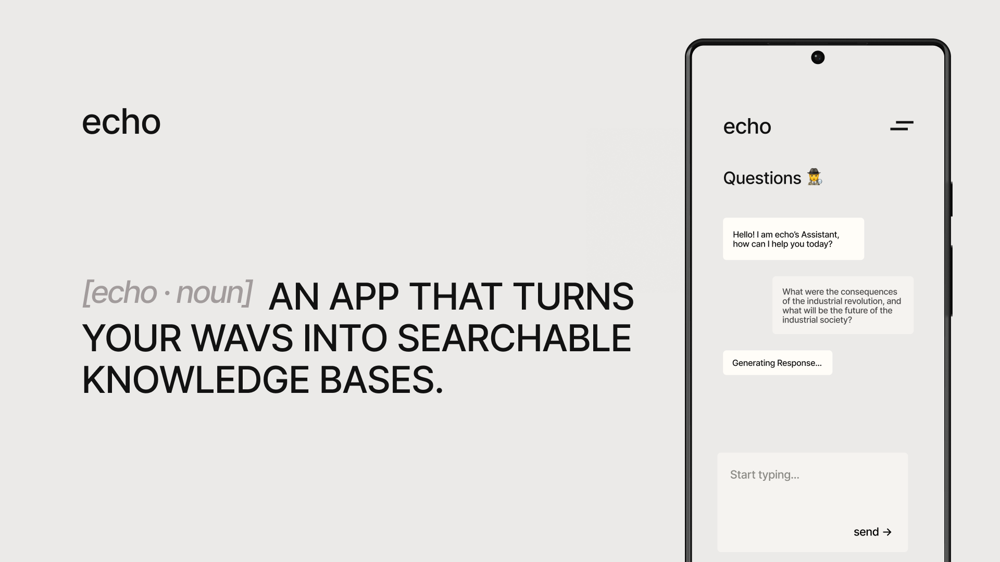

# Házi feladat specifikáció

Információk [itt](https://viauac00.github.io/laborok/hf)

## Mobil- és webes szoftverek

### 10/10/2023

### Echo

### Váradi Kristóf - (BP17IB)

### kristofvaradi@edu.bme.hu

### Laborvezető: Strbik Anna Viktória

## Bemutatás

Az Echo egy korszerű Android alkalmazás, amely lehetővé teszi a felhasználók számára, hogy hangfelvételt készítsenek, amelyet az alkalmazás szöveges formátumban tárol és vektorizált formátumban egy külső vektoradatbázisba menti. Az ötlet abból származik, hogy sokan szeretnének gyorsan és hatékonyan rögzíteni és keresni információkat anélkül, hogy manuálisan jegyzetelniük kellene. Az alkalmazás kiváló eszköz lehet diákoknak, újságíróknak és üzletembereknek, akik gyakran vesznek részt előadásokon és megbeszéléseken.

## Főbb funkciók

- **Felhasználói hitelesítés:** Az alkalmazás lehetővé teszi a felhasználók számára, hogy Google OAuth segítségével lépjenek be, biztosítva ezzel az adataik biztonságát.

- **Hangfelvétel:** A felhasználók rögzíthetnek hangfelvételeket közvetlenül az alkalmazás felületéről, ami intuitív és könnyen használható.

- **Audio Transzkribálás:** Az alkalmazás automatikusan transzkribálja a felvett hanganyagot szöveggé, lehetővé téve a gyors és pontos jegyzetelést.

- **Tudásbázis:** A transzkribált szövegek tárolása és indexelése egy vektor adatbázisban történik, ami gyors és hatékony lekérdezéseket tesz lehetővé.

- **Chat felület:** A felhasználók szöveges üzenetek segítségével kérdezhetik le a tudásbázist, és azonnal válaszokat kapnak a korábban tárolt információkra.

## Választott technológiák:

- RecyclerView

- Hálózati kommunikáció REST API-kkal

- Animációk

- Perzisztens adattárolás

# Házi feladat dokumentáció (ha nincs, ez a fejezet törölhető)
