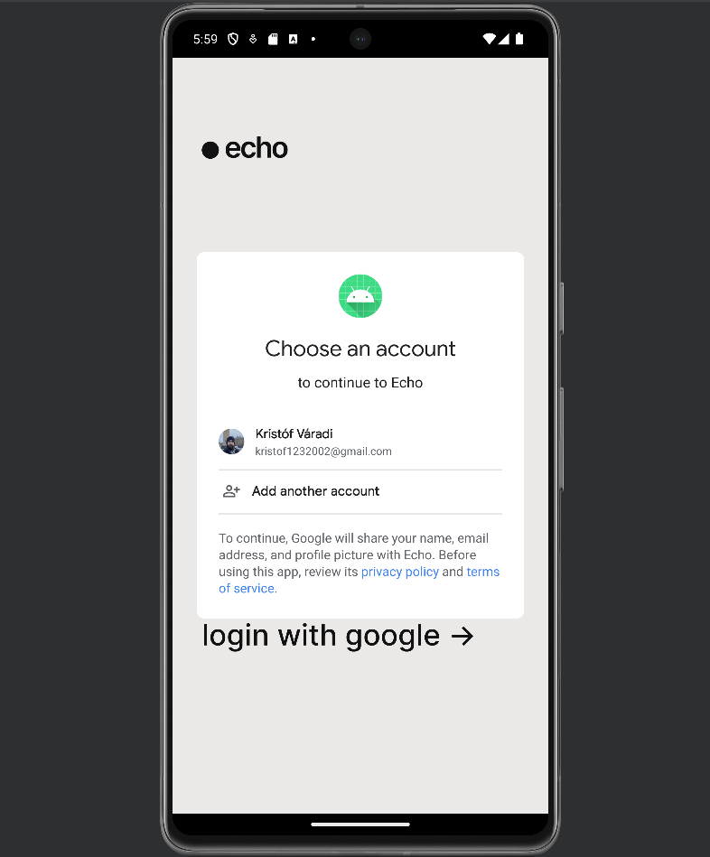
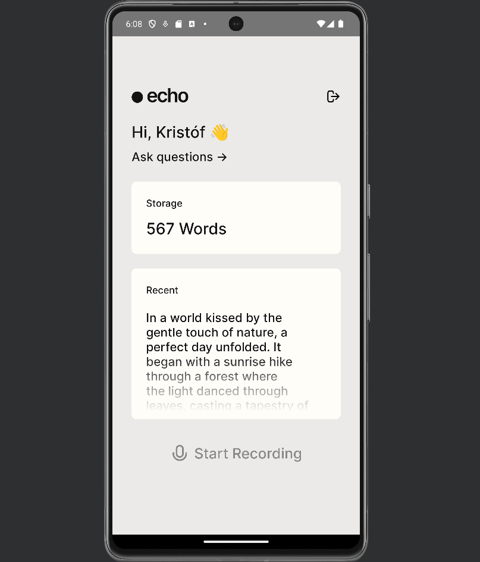
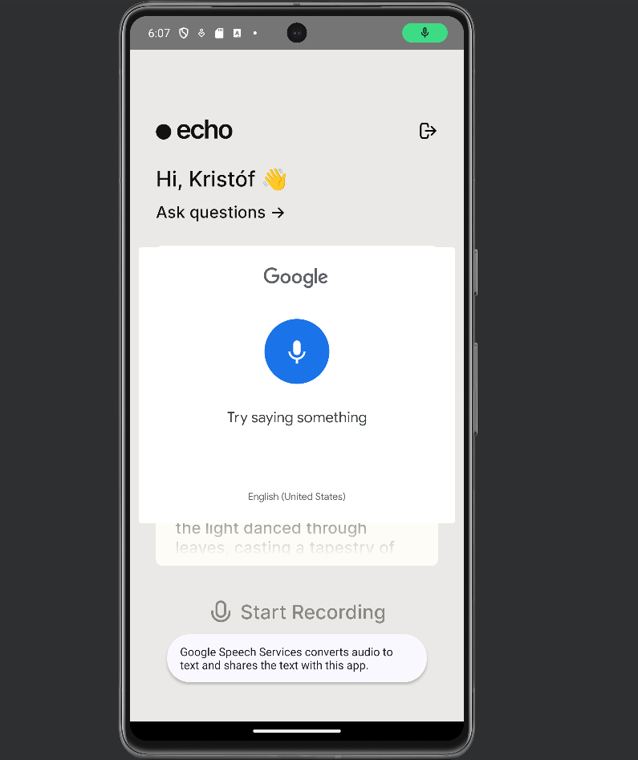
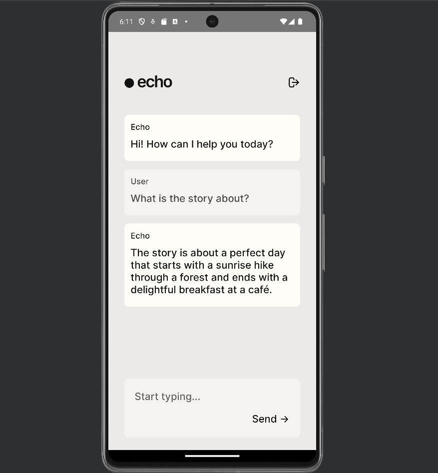

# Házi feladat specifikáció

Információk [itt](https://viauac00.github.io/laborok/hf)

## Mobil- és webes szoftverek

### 10/10/2023

### Echo

### Váradi Kristóf - (BP17IB)

### kristofvaradi@edu.bme.hu

### Laborvezető: Strbik Anna Viktória

## Bemutatás

Az Echo egy korszerű Android alkalmazás, amely lehetővé teszi a felhasználók számára, hogy hangfelvételt készítsenek, amelyet az alkalmazás szöveges formátumban tárol és vektorizált formátumban egy külső vektoradatbázisba menti. Az ötlet abból származik, hogy sokan szeretnének gyorsan és hatékonyan rögzíteni és keresni információkat anélkül, hogy manuálisan jegyzetelniük kellene. Az alkalmazás kiváló eszköz lehet diákoknak, újságíróknak és üzletembereknek, akik gyakran vesznek részt előadásokon és megbeszéléseken.


## Főbb funkciók

- **Felhasználói hitelesítés:** Az alkalmazás lehetővé teszi a felhasználók számára, hogy Google OAuth segítségével lépjenek be, biztosítva ezzel az adataik biztonságát.

- **Hangfelvétel:** A felhasználók rögzíthetnek hangfelvételeket közvetlenül az alkalmazás felületéről, ami intuitív és könnyen használható.

- **Audio Transzkribálás:** Az alkalmazás automatikusan transzkribálja a felvett hanganyagot szöveggé, lehetővé téve a gyors és pontos jegyzetelést.

- **Tudásbázis:** A transzkribált szövegek tárolása és indexelése egy vektor adatbázisban történik, ami gyors és hatékony lekérdezéseket tesz lehetővé.

- **Chat felület:** A felhasználók szöveges üzenetek segítségével kérdezhetik le a tudásbázist, és azonnal válaszokat kapnak a korábban tárolt információkra.

## Választott technológiák:

- RecyclerView

- Hálózati kommunikáció REST API-kkal

- Animációk

- Perzisztens adattárolás

# Házi feladat dokumentáció

## Bevezetés

Az `Echo` nevű alkalmazás segítségével természetes nyelven rögzíthetünk hangjegyzeteket telefonon keresztül, majd egy nagy nyelvi modell (`GPT-3.5-turbo`) segítségével cseveghetünk a hangjegyzetek tartalmáról.

## Futtatási környezet, engedélyek

Az applikáció Android alapú operációs rendszerekkel rendelkező mobileszközökön futtatható. A rendszer verziója legalább `26`-os, valamint az eszköznek rendelkeznie kell hangrögzítésre mikrofonnal.

Az applikáció felhasználójának rendelkeznie kell Google fiókkal, hiszen ez alapján azonosíthatóak a rögzített jegyzetek.

Az applikációnak engedélyt kell adni az internet elérésére (`android.permission.INTERNET`), valamint az audiórögzítére (`android.permission.RECORD_AUDIO`).

## Limitációk

Az alkalmazás emulátoron futtatva nem tud audiót rögzíteni az `android.speech`, illetve az emulátor mikrofonbeállításai miatt. A funkcionalitás letesztelhető, a gombra kattintva megjelenik a Speech to Text ablak, azonban a hangbemenet hiánya miatt nem tudja szöveggé konvertálni a beszédet.

Az alkalmazás funkcionalitását emulátoron keresztül úgy tesztelhetjük, hogy a `HomeActivity.kt`-ban lecseréljük a `mockText` változó értékét az általunk menteni kívánt szövegre.

```Kotlin
// HomeActivity.kt

private var speechResultLauncher = registerForActivityResult(ActivityResultContracts.StartActivityForResult()) { result ->
    if (result.resultCode == Activity.RESULT_OK) {
        val results = result.data?.getStringArrayListExtra(RecognizerIntent.EXTRA_RESULTS)
        val recognizedText = results?.get(0) ?: ""
        saveTranscription(recognizedText)
        Log.d("MainActivity", recognizedText)
    } else {
        Log.d("MainActivity", "Google Speech recognizer could not pick up speech, inserting mock context.")
        val mockText = """Elmenteni kívánt szöveg""".trimIndent()

        saveTranscription(mockText)
    }
}
```

## Használati útmutató

### Bejelentkezés

Az applikációt megnyitva elsőként be kell jelentkeznünk az alkalmásba egy Google felhasználói fiók segítségével. A `login with google` gomb megnyomása után bejelentkezhetünk az Email-címünk és jelszavunk megadásával.



### Áttekintő nézet

A sikeres bejelentkezést követően egy áttekintő oldalra kerülünk. Itt látható a legutoljára rögzített hangjegyzet átirata, valamint az eddig rögzített szavak száma.



Az `Ask questions` gombot megnyomva az alkalmazás átirányít minket a chat-felületre.

### Jegyzetrögzítés

Az alul található `Start Recording` gombot megnyomva megjelenik a Google Speech to Text modulja, amellyel angol nyelvű hangjegyzeteket rögzíthetünk, amit az alkalmazás automatikusan szöveggé konvertál.



### Chat felület

Az `Ask questions` gombra kattintva megjelenik előttünk a chat felület, ahol begépelhetjük az elküldeni kívánt üzenetet, a nyelvi modell pedig válaszol rá, figyelembe véve az eddig feltöltött hangjegyzeteket.



### Kijelentkezés

Az applikációból a fenti kilépés ikont megnyomva tudunk kijelentkezni. Ekkor az alkalmazás átirányít minket a korábban tárgyalt kezdőlapra, ahol Google segítségével ismét bejelentkezhetünk.

